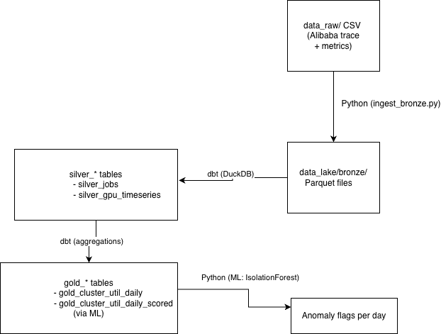
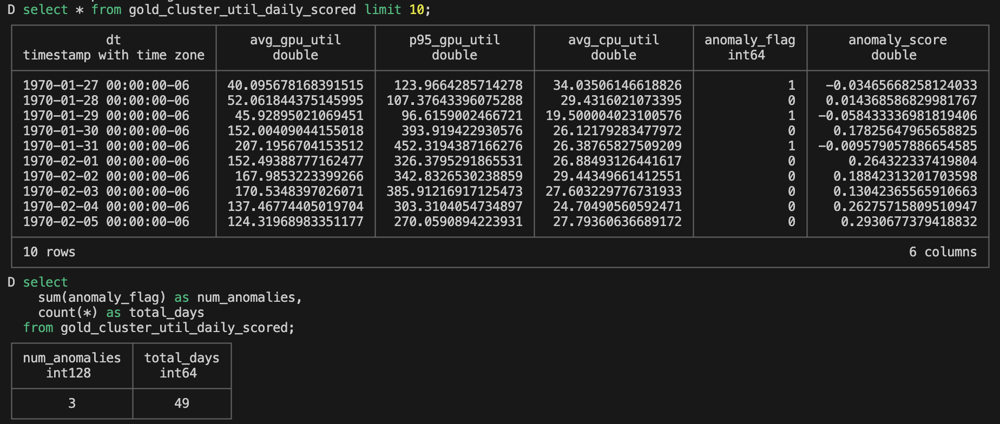
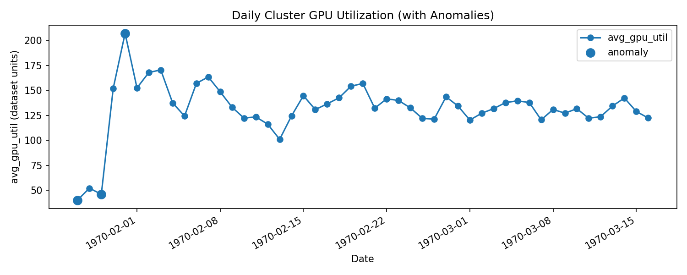

# GPU Training Cluster Telemetry Lakehouse

A minimal, end-to-end **GPU observability & efficiency lakehouse** built on public cluster traces.

This project simulates how big AI / hardware companies watch their GPU fleets:

- Raw job logs + machine metrics land in a **Medallion** lakehouse (bronze / silver / gold)
- A **Prefect** flow orchestrates ingestion and transformations
- A small **ML model** (IsolationForest) flags anomalous cluster days

> ⚠️ **Important:**  
> This project is built on **public sample datasets**, not a real production GPU cluster.  
> The core architecture and patterns are realistic, but functionality is intentionally limited to what the datasets support.

---

## Table of Contents

- [Data Sources](#data-sources)
- [Professional Architecture](#professional-architecture)
- [Data Transformations – Medallion Model](#data-transformations--medallion-model)
- [Pipeline Orchestration (Prefect)](#pipeline-orchestration-prefect)
- [ML: Daily Cluster Anomaly Detection](#ml-daily-cluster-anomaly-detection)
- [How to Run This Project Locally](#how-to-run-this-project-locally)
- [Ideas for Future Work](#ideas-for-future-work--limitations)
- [Lessons Learned / Gotchas](#lessons-learned--gotchas)

---

## Data Sources

All datasets are **public** and downloaded via the Kaggle CLI into `data_raw/`.  
Large data files (`data_raw/`, `data_lake/`) are **not committed** to git; instead, scripts and instructions make the project reproducible.

### 1. Alibaba GPU Cluster Trace – Jobs & Metrics

After downloading and unzipping, the key CSVs are:

#### `data_raw/pai_job_table.csv`
Job-level information:
- `job_name` – used as `job_id`
- `inst_id` – instance id
- `user` – used as `user_id`
- `status` – job status (Running, Terminated, etc.)
- `start_time`, `end_time` – numeric timestamps (seconds from a cluster reference point)

#### `data_raw/pai_instance_table.csv`
Per-instance details for each job (kept in bronze for future extensions).

#### `data_raw/pai_machine_metric.csv`
Machine-level metrics over time:
- `worker_name`, `machine`
- `start_time`, `end_time`
- `machine_gpu` – used as `gpu_util_pct`
- `machine_cpu` – used as `cpu_util_pct`
- `machine_cpu_iowait`, `machine_cpu_kernel`, `machine_cpu_usr`
- `machine_load_1`, `machine_net_receive`, `machine_num_worker`

#### `data_raw/pai_machine_spec.csv`
Hardware specs for machines (CPU, memory, etc.); currently modeled in bronze and available for future joins.

**Approximate data sizes (from ingestion logs):**
- ~1,055,501 job rows
- ~7,522,002 instance rows
- ~2,009,423 machine metric rows

These provide realistic job timelines and telemetry similar to what a GPU cluster control plane would see.

### 2. GPU Specs (TechPowerUp Scrape Mirror)

#### `data_raw/tpu_gpus.csv`

Columns include:
- `Product_Name`
- `GPU_Chip`
- `Released`
- `Bus`
- `Memory`
- `GPU_clock`, `Memory_clock`
- `Shaders_TMUs_ROPs`

This becomes `bronze_gpu_specs` — a dimension-like table representing GPU models.  
In this minimal version it's mostly a **placeholder** for future analysis (e.g., performance or thermals by GPU model).

---

## Professional Architecture

**High-level system design:**



### How to Read the Diagram

#### 1. Raw Data (top-right: `data_raw/ CSV`)

- Public CSVs from Kaggle:
  - Alibaba job + machine metrics
  - GPU specs
- These mimic:
  - Cluster scheduler job tables
  - Node-level metric exporters

#### 2. Ingestion (Python – `ingest_bronze.py`)

- Reads CSVs with pandas
- Writes Parquet files into `data_lake/bronze/`
- This step is analogous to:
  - Log shipper / ETL jobs
  - Converting raw text/CSV into columnar storage suitable for analytics

#### 3. Bronze Storage (`data_lake/bronze/*.parquet`)

Holds:
- `bronze_job_events.parquet`
- `bronze_instance_table.parquet`
- `bronze_machine_metrics.parquet`
- `bronze_machine_spec.parquet`
- `bronze_gpu_specs.parquet`

Structure is close to original source formats; minimal transformation.

#### 4. dbt (DuckDB) – Silver / Gold Tables

- dbt models read Parquet via DuckDB's `read_parquet(..)`
- Bronze views → `silver_jobs`, `silver_gpu_timeseries`
- Aggregations → `gold_cluster_util_daily`

This is where:
- Types are cleaned
- Column names are normalized
- Derived features (like `run_time_sec`) are added

#### 5. ML Layer (Python: IsolationForest)

- Uses `gold_cluster_util_daily` as input
- Trains and scores an IsolationForest model
- Writes `gold_cluster_util_daily_scored` back into DuckDB
- Produces:
  - `anomaly_flag` (0 / 1)
  - `anomaly_score` (decision score)

#### 6. Orchestration (Prefect)

`flow_full_refresh` orchestrates:
1. Bronze ingestion
2. dbt `run` and `test`
3. ML training and scoring

One command rebuilds the entire lakehouse from raw data.

---

## Data Transformations – Medallion Model

This project follows the **Medallion architecture** pattern:

- **Bronze** – Raw, minimally processed Parquet (close to source)
- **Silver** – Cleaned and standardized tables with derived columns
- **Gold** – Aggregated, business / ML-ready tables

### Bronze Layer – Raw Parquet

Generated by `pipelines/ingest_bronze.py` from `data_raw/*.csv` into `data_lake/bronze/`:

| File | Source | Purpose |
|------|--------|---------|
| `bronze_job_events.parquet` | `pai_job_table.csv` | One row per job |
| `bronze_instance_table.parquet` | `pai_instance_table.csv` | One row per job instance |
| `bronze_machine_metrics.parquet` | `pai_machine_metric.csv` | Machine metrics by time window |
| `bronze_machine_spec.parquet` | `pai_machine_spec.csv` | Machine hardware specs |
| `bronze_gpu_specs.parquet` | `tpu_gpus.csv` | GPU model specs |

**Goal:** Schema persistence, not business logic. Just get data into a lake-friendly format.

---

### Silver Layer – Cleaned / Normalized Tables

Defined in `dbt_project/gpu_telemetry/models/silver/`.

#### `silver_jobs`

**Source:** `bronze_job_events`

**Transformations:**
- `job_name` → `job_id`
- `inst_id` → `instance_id`
- `"user"` → `user_id`
- `status` → `job_status`
- `start_time`, `end_time` kept as numeric timestamps
- `run_time_sec` calculated as:
  ```sql
  case
    when end_time is not null then end_time - start_time
    else null
  end as run_time_sec
  ```

**Semantics:**
- One row per job
- `run_time_sec` represents how long a job ran (if it finished)
- Jobs still Running have `end_time` and `run_time_sec` as `NULL`

**Tests in `models/silver/silver.yml`:**
- `job_id` is `not_null` and `unique`
- `user_id` is `not_null`

This table behaves like a **central job dimension** you can join with metrics.

#### `silver_gpu_timeseries`

**Source:** `bronze_machine_metrics`

**Transformations:**
- `machine` → `machine_id`
- `end_time` → `ts` (timestamp for metric)
- `machine_gpu` → `gpu_util_pct`
- `machine_cpu` → `cpu_util_pct`

**Additional columns preserved:**
- `machine_load_1`
- `machine_net_receive`
- `machine_cpu_iowait`, `machine_cpu_kernel`, `machine_cpu_usr`
- `machine_num_worker`

**Filter:** `where end_time is not null` to ensure valid timestamps

**Tests:**
- `machine_id` is `not_null`
- `ts` is `not_null`

This provides a **machine-level time series** for plotting utilization over time or aggregating to gold.

---

### Gold Layer – Analytics & ML-Ready

Defined in `dbt_project/gpu_telemetry/models/gold/`.

#### `gold_cluster_util_daily`

**Source:** `silver_gpu_timeseries`

**Steps:**
1. Convert numeric `ts` into timestamp and truncate to day:
   ```sql
   date_trunc('day', to_timestamp(ts)) as dt
   ```

2. Aggregate per day (`group by dt`):
   - `avg_gpu_util = avg(gpu_util_pct)`
   - `p95_gpu_util = quantile_cont(gpu_util_pct, 0.95)`
   - `avg_cpu_util = avg(cpu_util_pct)`

**Result:**
- One row per day (`dt`)
- Daily summary of cluster load

**Tests in `models/gold/gold.yml`:**
- `dt` is `not_null`
- `dt` is `unique`

This table is the **primary input** for the anomaly detection ML model.

#### `gold_cluster_util_daily_scored`

- Created by `ml/score_cluster_anomalies.py` (Python), not dbt
- Extends `gold_cluster_util_daily` with:
  - `anomaly_flag` – 0 for normal days, 1 for anomalous days
  - `anomaly_score` – IsolationForest decision score (lower = more anomalous)

**Sample data preview:**



**Summary statistics:**
- `total_days` ≈ 49
- `num_anomalies` = 3

---

## Pipeline Orchestration (Prefect)

The whole pipeline is orchestrated with **Prefect 2.x**.

### Flow Definition

**File:** `pipelines/flow_full_refresh.py`

```python
@flow(name="gpu_telemetry_full_refresh")
def full_refresh():
    ingest_bronze()
    run_dbt()
    run_ml_scoring()
```

### Task 1 – `ingest_bronze`

```python
@task
def ingest_bronze():
    subprocess.run(
        [sys.executable, "pipelines/ingest_bronze.py"],
        cwd=PROJECT_ROOT,
        check=True,
    )
```

- Uses `sys.executable` to guarantee the active venv is used
- Runs `pipelines/ingest_bronze.py`, which:
  - Reads CSVs from `data_raw/`
  - Writes Parquet files into `data_lake/bronze/`
  - Logs row counts for each bronze dataset

### Task 2 – `run_dbt`

```python
@task
def run_dbt():
    subprocess.run(
        ["dbt", "run"],
        cwd=DBT_DIR,
        check=True,
        env=_dbt_env(),
    )
    subprocess.run(
        ["dbt", "test"],
        cwd=DBT_DIR,
        check=True,
        env=_dbt_env(),
    )
```

- `DBT_DIR` points to `dbt_project/gpu_telemetry`
- `_dbt_env()` sets `DUCKDB_PATH` so dbt knows where `telemetry.db` is

**dbt run:**
- Builds bronze views
- Builds silver tables
- Builds gold table

**dbt test:**
- Runs schema tests for:
  - `silver_jobs`
  - `silver_gpu_timeseries`
  - `gold_cluster_util_daily`

### Task 3 – `run_ml_scoring`

```python
@task
def run_ml_scoring():
    subprocess.run(
        [sys.executable, "ml/train_cluster_anomaly_model.py"],
        cwd=PROJECT_ROOT,
        check=True,
    )
    subprocess.run(
        [sys.executable, "ml/score_cluster_anomalies.py"],
        cwd=PROJECT_ROOT,
        check=True,
    )
```

- Calls `ml/train_cluster_anomaly_model.py` – trains IsolationForest
- Calls `ml/score_cluster_anomalies.py` – writes `gold_cluster_util_daily_scored`

### Running the Flow

One command triggers the entire stack:

```bash
python pipelines/flow_full_refresh.py
```

---

## ML: Daily Cluster Anomaly Detection

The ML component focuses on detecting anomalous cluster days based on daily utilization patterns.

### Training – `ml/train_cluster_anomaly_model.py`

**Steps:**

1. Load `gold_cluster_util_daily` from `telemetry.db`:
   - `dt`
   - `avg_gpu_util`
   - `p95_gpu_util`
   - `avg_cpu_util`

2. Select feature columns:
   ```python
   feature_cols = ["avg_gpu_util", "p95_gpu_util", "avg_cpu_util"]
   ```

3. Standardize features with `StandardScaler`

4. Train an IsolationForest model:
   ```python
   model = IsolationForest(
       n_estimators=100,
       contamination=0.05,  # ≈5% of days treated as anomalies
       random_state=42,
   )
   ```

5. Save artifacts:
   - Model: `ml/cluster_anomaly_iforest.joblib`
   - Scaler: `ml/cluster_anomaly_scaler.joblib`

### Scoring – `ml/score_cluster_anomalies.py`

**Steps:**

1. Reload `gold_cluster_util_daily` sorted by `dt`
2. Reload the saved model + scaler
3. Transform features and score:
   ```python
   preds = model.predict(X_scaled)          # 1 = normal, -1 = anomaly
   scores = model.decision_function(X_scaled)
   ```

4. Add columns:
   ```python
   anomaly_flag = (preds == -1).astype(int)
   anomaly_score = scores
   ```

5. Replace table `gold_cluster_util_daily_scored` in DuckDB

### Visualization

The following plot shows daily average GPU utilization, with anomalous days highlighted:



**Interpretation:**
- Most days have relatively stable GPU utilization
- A small fraction (3 out of 49) are flagged as anomalous — days where the utilization pattern differs significantly from the rest

---

## How to Run This Project Locally

### 1. Prerequisites

- Python 3.11
- Git
- Kaggle account + API token
- (Optional) DuckDB CLI installed for interactive queries

### 2. Clone the Repository

```bash
git clone <your-repo-url>.git
cd gpu-telemetry-lakehouse
```

### 3. Create and Activate a Virtual Environment

```bash
python3.11 -m venv .venv
source .venv/bin/activate
```

### 4. Install Dependencies

```bash
python -m pip install --upgrade pip

python -m pip install \
  "prefect<3" \
  "dbt-duckdb<2" \
  duckdb \
  pandas \
  pyarrow \
  scikit-learn \
  joblib \
  kaggle
```

### 5. Configure Kaggle API

Generate `kaggle.json` from your Kaggle account.  
Move it to the standard location:

```bash
mkdir -p ~/.kaggle
mv ~/Downloads/kaggle.json ~/.kaggle/kaggle.json
chmod 600 ~/.kaggle/kaggle.json
```

### 6. Download Data into `data_raw/`

From project root:

```bash
cd data_raw

# Example (you should use the exact datasets you used originally):
# kaggle datasets download -d derrickmwiti/cluster-trace-gpu-v2020 --unzip
# kaggle datasets download -d baraazaid/cpu-and-gpu-stats --unzip

cd ..
```

### 7. Run the Full Lakehouse Pipeline

```bash
source .venv/bin/activate
python pipelines/flow_full_refresh.py
```

This will:
- Recreate `data_lake/bronze/*.parquet`
- Build dbt models (bronze views, silver, gold)
- Run dbt tests
- Train & score the anomaly model

### 8. Inspect Tables in DuckDB

```bash
duckdb telemetry.db
.tables
select * from silver_jobs limit 5;
select * from gold_cluster_util_daily limit 5;
select * from gold_cluster_util_daily_scored limit 10;
select sum(anomaly_flag) as num_anomalies, count(*) as total_days
from gold_cluster_util_daily_scored;
.quit
```

---

## Ideas for Future Work / Limitations

**Limitation:** Because this is a project built on sample public datasets, some functionalities that a real GPU observability platform would have are not possible (e.g., GPU temperature, power draw, DCGM-style error metrics, live streaming from exporters).

That said, the architecture is a solid starting point and can be extended in several directions:

### Job- and User-Level Efficiency Marts

- **`gold_job_efficiency_daily`**
  - GPU-hours allocated vs. GPU-hours actively used
  - Efficiency scores per job

- **`gold_user_gpu_usage_daily`**
  - Per-user GPU-hours, job counts, and failure rates

### Richer GPU-Level Metrics

Simulate additional fields such as:
- GPU memory usage / utilization
- Power draw
- Temperature
- Error counts (ECC, throttling)

Build gold tables for:
- Hot / throttled GPUs
- Error spikes per day

### BI / Dashboard Layer

Add Apache Superset or Metabase pointing at DuckDB.

Dashboards like:
- Daily utilization with anomaly overlay
- Top anomalous days, with drill-down into job lists
- Job queue and runtime distributions

### Streaming Simulation

Wrap `pai_machine_metric` data in a "replay" script that pushes events into Kafka or a simple in-memory queue.  
Use a streaming framework (or periodic batches) to ingest into bronze, to mimic real-time telemetry.

### Alerting / Notifications

When new anomaly days are detected:
- Insert rows into an alerts table
- In a real deployment, push alerts to Slack / email / PagerDuty, etc.

---

## Lessons Learned / Gotchas

This project surfaced several realistic issues that data engineers routinely face:

### Python Version Compatibility Matters

Prefect 2.x and dbt-duckdb work well on Python 3.11.  
Attempting this on Python 3.14 led to dependency build failures (e.g., asyncpg), so downgrading to 3.11 was necessary.

### Use `sys.executable` Instead of "python" in Subprocesses

Shell aliases may point `python` at a different interpreter than your virtualenv.  
Using `sys.executable` ensures all subprocesses use the correct venv.

### Do Not Commit Raw Data to Git

`data_raw/` and `data_lake/` can be large and change frequently.

Better to:
- Add them to `.gitignore`
- Provide reproducible download instructions (Kaggle) and ingestion scripts

### dbt Models Should Not End with Semicolons

dbt adds its own semicolons when compiling.  
Leaving a trailing `;` in the model SQL can create `;;` and cause DuckDB parser errors.  
Removing the trailing semicolon fixed the bronze view creation errors.

### Prefect Internal DB Migrations Can Break

Upgrading Prefect with an old `~/.prefect/prefect.db` in place can cause Alembic migration errors ("Can't locate revision…").

Deleting `~/.prefect/prefect.db` and `~/.prefect/storage` lets Prefect recreate a fresh, compatible database.

### Medallion First, Fancy Stuff Later

Building a clean Medallion model (bronze → silver → gold) before adding ML and orchestration made debugging easier.

Once the data model was stable, adding Prefect and IsolationForest on top was straightforward.

---
